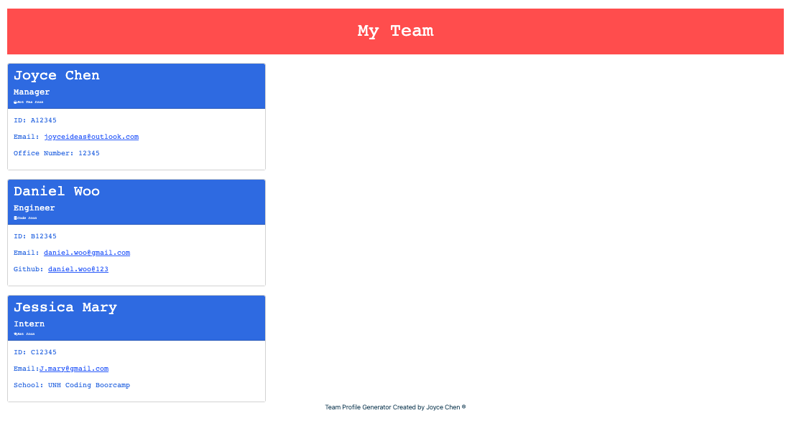

# OOP-team-profile-generator

## License:

---

## Table of Contents:

- [License](#license)
- [Purpose](#purpose)
- [Usage](#usage)
- [Knowledge](#knowledge)
- [Demo Video](#demo-video)
- [Demo Image](#demo-image)
- [Deployed URL](#deployed-url)
- [Questions](#questions)

---

## Purpose:

A Node.js command-line `node index.js` application will help a business team to access their team members' information quickly.

---

## Usage:

To build a Node.js command-line `node index.js` application that takes in information about employees on a software engineering team, then generates an HTML webpage that displays summaries of the team's basic information for each person to help the company organization.

How to use it- Run `node index.js` in the terminal to start choosing the team role and entering their information to save the data. After creating all needed team members, the `generateHTML.js` will automatically create a HTML page from `index.html` for you.

---

## Knowledge:

- `JavaScript`
- `Node index.js`
- `Express.js`
- Installation: Run `npm install` to install the packages and dependencies.

---

## Demo Video:

[Team Profile Generator Walkthrough Video](https://youtu.be/AatsHT8jUro)

---

## Deployed Image:

## 
---

## Deployed URL:

- [Github URL](https://github.com/Joyce750526/OOP-team-profile-generator)

- [Github Deployed Page](https://joyce750526.github.io/OOP-team-profile-generator/)

---

## Questions:

If you have any questions about this projects, please contact me!

- [Email Me](mailto:joyceideas@outlook.com)
- [Github](https://github.com/joyce750526)

---

 Chao-Ying(Joyce) Chen
