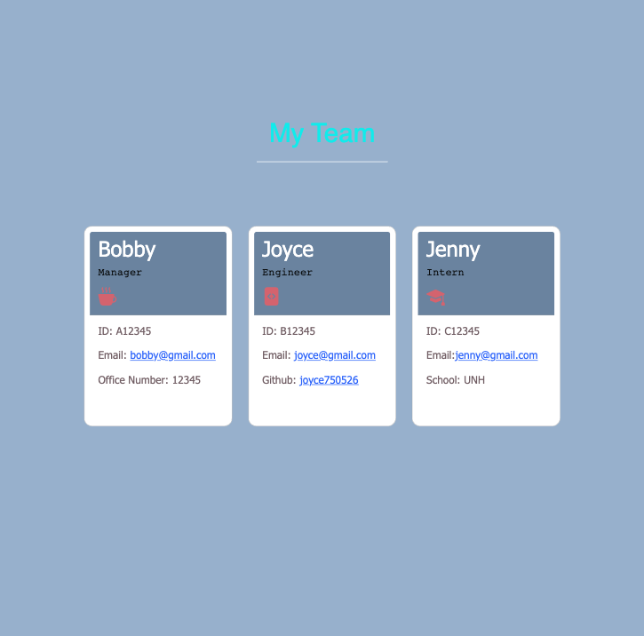

# OOP-team-profile-generator

## License:

  

  

---

## Table of Contents:

- [License](#license)
- [Purpose](#purpose)
- [Installation](#installation)
- [Demo Video](#demo-video)
- [Deployed Image](#deployed-image)
- [Deployed URL](#deployed-url)
- [Questions](#questions)

---

## Purpose:

A Node.js command-line application will help a business team to access their team members' information quickly.

This application that takes in information about employees on a software engineering team, then generates an HTML webpage that displays summaries of the team's basic information for each person to help the company organization.

How to use it- Run `node index.js` in the terminal to start choosing the team role and entering their information to save the data. After creating all needed team members, the `generateHTML.js` will automatically create a HTML page from `index.html` for you.

---

## Installation:

To use this Team Profile Generator Application. Please refer the following steps.

1. You need to clone this package in your computer, and open in VS Code.

2. You need to run `npm install inquirer@8.2.4` in the terminal first to get all necessary dependencies.

3. Run `node index.js` in your VS Code terminal to start this application. Hence, you will be able to select which employee you want to add by entering the required data!
---

## Demo Video:

[Team Profile Generator Walkthrough Video](https://youtu.be/AatsHT8jUro)

---

## Deployed Image:

## 
---

## Deployed URL:

- [Github URL](https://github.com/Joyce750526/OOP-team-profile-generator)

- [ReadMe Deployed Page](https://joyce750526.github.io/OOP-team-profile-generator/)

---

## Questions:

If you have any questions about this projects, please contact me!

- [Email Me](mailto:joyceideas@outlook.com)
- [Github](https://github.com/joyce750526)

---

 Chao-Ying(Joyce) Chen
